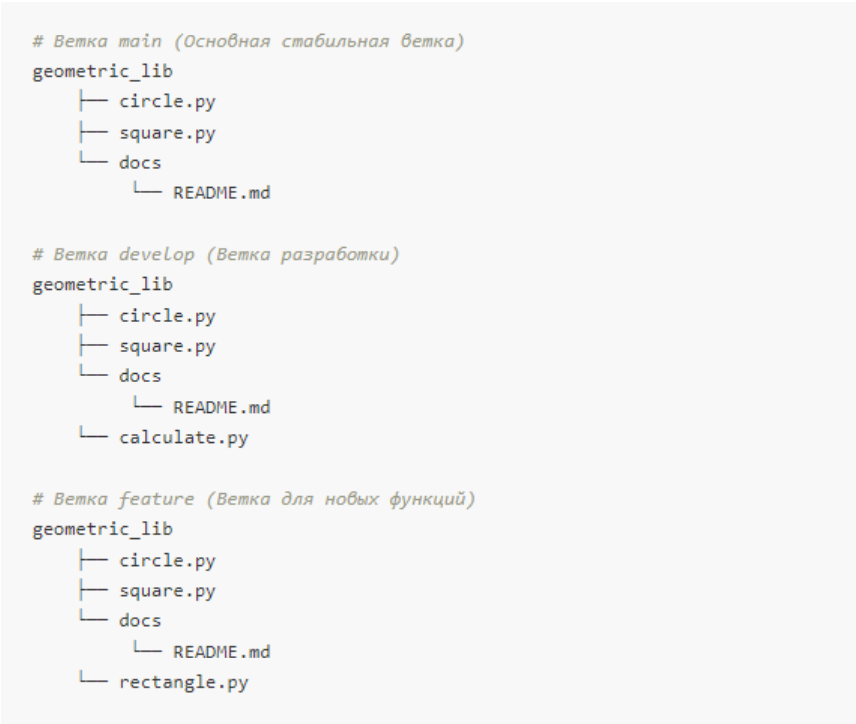
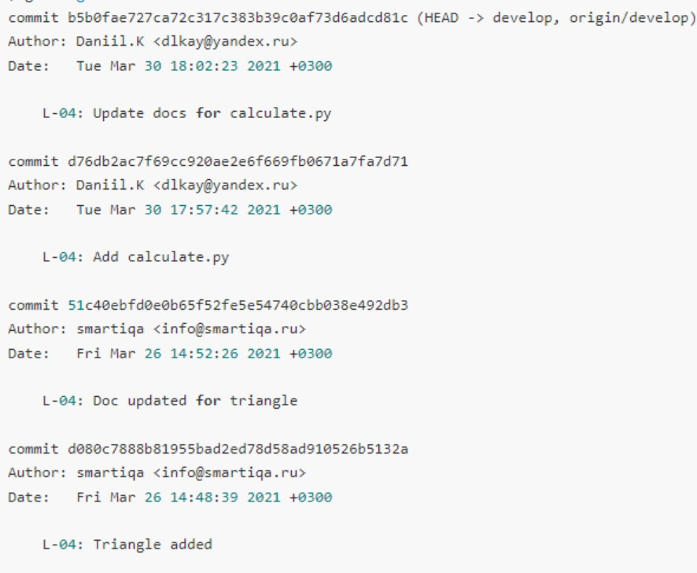
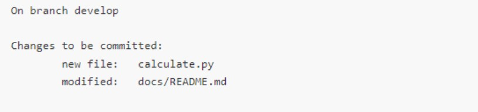
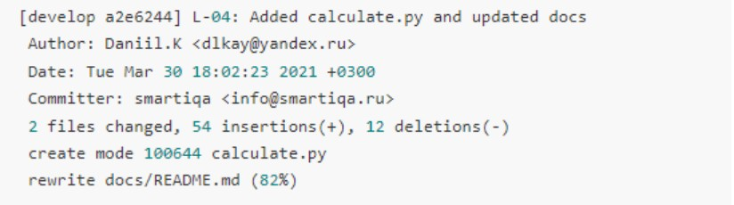
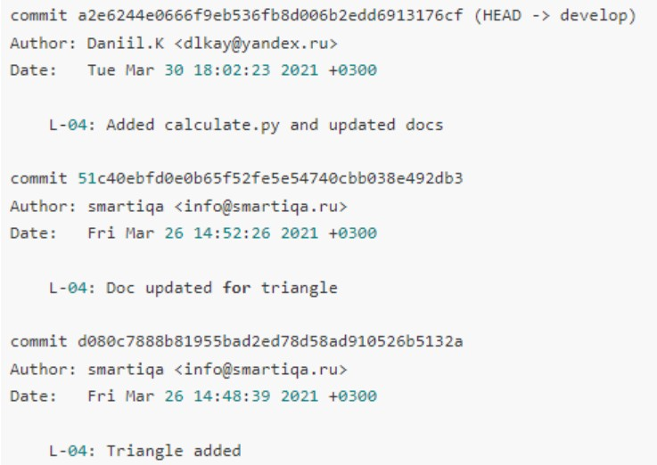

# Задачи

---
Дана библиотека, написанная на Python - Geometric Lib. Файловая структура данной
библиотеки представлена ниже: 


1. Необходимо объединить два коммита в ветке “develop” одной и той же тематики "L-04:
Add calculate.py", "L-04: Update docs for calculate.py" и написать к нему пояснение
# Решение

--- 

Выполним задачу:

Переходим на ветку `develop`
```
git checkout develop
```

Просматриваем историю коммитов ветки `develop`  
Коммиты b5b0fa и d76db2 можно объединить
```
git log
```


Просматриваем текущее состояние
``` 
git status
```


**Делаем объединяющий коммит**
``` 
git commit -c ORIG_HEAD
```


Убеждаемся что в истории появился еще один коммит фа2е624  
Который объединяет в себе коммиты b5b0fa и d76db2
``` 
git log
```

[Назад](../../readme.md)