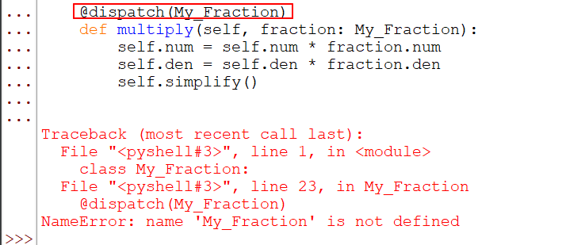

# Задачи

---
При помощи классов можно описывать не только вещи и целые числа, но и
рациональные дроби. В языке Python, для данной ситуации, имеется готовый тип
“Fraction” в модуле fractions.

1. Создать класс “My_Fraction” который представляет рациональную дробь (num -
числитель, den - знаменатель);
2. Данный класс должен содержать конструктор и перегруженные методы как
умножения, так и деления (дроби на дробь и дроби на целое число);
3. Метод создания случайной дроби из заданного диапазона целых чисел должен быть
объявлен, как статический.

   
# Решение

---

### 1) задача

Создадим класс `My_Fraction`
```python
class My_Fraction:
    den = 1
    num = 1 
```

### 2) задача

Добавим классу конструктор и обработаем попытку пользователя сделать знаменатель равным нулю 
```python
class My_Fraction:
    def __init__(self, num: int, den: int):
        if den == 0:
            raise ZeroDivisionError("Fraction's denominator can't be 0")
        self.num = num
        self.den = den
```
Так как пользователь может передать нам не сокраенную дробь, например 3/9 следует написать функцию упрощения и вызывать ее после конструктора
```python
class My_Fraction:
    def __init__(self, num: int, den: int):
        if den == 0:
            raise ZeroDivisionError("Fraction's denominator can't be 0")
        self.num = num
        self.den = den
        self.simplify()

    def simplify(self):
        for _ in range(min(self.num, self.den), 1, -1):
            if self.num % _ == 0 and self.den % _ == 0:
                self.num = self.num // _
                self.den = self.den // _
                self.simplify()
```

Напишем 2 _**метода вне класса**_ для высчитывания умножения на число и дробь соответственно
```python
# Для числа
def multiply(self, number: int):
    self.num = self.num * number
    self.den = self.den
    self.simplify()


# Для другой дроби
def multiply(self, fraction: My_Fraction):
    self.num = self.num * fraction.num
    self.den = self.den * fraction.den
    self.simplify()
```
> В python для перегрузки используют декоратор `dispatch`, который принимает в качестве аргументов типы входных данных функции/метода  

В нашей ситуации в одном случае мы передадим в аргументы декоратору `int`, а в другом случае мы вынуждены передать типом данных класс `My_Faction`. Тогда у нас получится следуюий код
```python
from multipledispatch import dispatch


class My_Fraction:
    def __init__(self, num: int, den: int):
        if den == 0:
            raise ZeroDivisionError("Fraction's denominator can't be 0")
        self.num = num
        self.den = den
        self.simplify()

    def simplify(self):
        for _ in range(min(self.num, self.den), 1, -1):
            if self.num % _ == 0 and self.den % _ == 0:
                self.num = self.num // _
                self.den = self.den // _
                self.simplify()

    @dispatch(int)
    def multiply(self, number: int):
        self.num = self.num * number
        self.den = self.den
        self.simplify()
    
    
    @dispatch(My_Fraction)
    def multiply(self, fraction: My_Fraction):
        self.num = self.num * fraction.num
        self.den = self.den * fraction.den
        self.simplify()
```
В данном случае код вызовет ошибку, так как декоратор используется во время сооздания класса, и класса еще не существует
а следовательно и типом данных он быть не может:
  

Поэтому объявим данные методы после класса, а ему уже присвоим их, а в самом классе напишем метод указывающий на ожидаемый формат данных:
```python
from multipledispatch import dispatch


class My_Fraction:
    def __init__(self, num: int, den: int):
        if den == 0:
            raise ZeroDivisionError("Fraction's denominator can't be 0")
        self.num = num
        self.den = den
        self.simplify()

    def simplify(self):
        for _ in range(min(self.num, self.den), 1, -1):
            if self.num % _ == 0 and self.den % _ == 0:
                self.num = self.num // _
                self.den = self.den // _
                self.simplify()

    def multiply(self, number: int | My_Fraction) -> My_Fraction:
        ...
    

@dispatch(int)
def multiply(self, number: int):
    self.num = self.num * number
    self.den = self.den
    self.simplify()


@dispatch(My_Fraction)
def multiply(self, fraction: My_Fraction):
    self.num = self.num * fraction.num
    self.den = self.den * fraction.den
    self.simplify()


My_Fraction.multiply = multiply
```
После этого мы снова видим ошибку об отсутствии типа данных `My_Fraction`. Напишем пустой класс с таким же названием перед этим 

```python
from multipledispatch import dispatch


class My_Fraction:
    ...


class My_Fraction:
    def __init__(self, num: int, den: int):
        if den == 0:
            raise ZeroDivisionError("Fraction's denominator can't be 0")
        self.num = num
        self.den = den
        self.simplify()

    def simplify(self):
        for _ in range(min(self.num, self.den), 1, -1):
            if self.num % _ == 0 and self.den % _ == 0:
                self.num = self.num // _
                self.den = self.den // _
                self.simplify()

    def multiply(self, number: int | My_Fraction) -> My_Fraction:
        ...
    

@dispatch(int)
def multiply(self, number: int):
    self.num = self.num * number
    self.den = self.den
    self.simplify()


@dispatch(My_Fraction)
def multiply(self, fraction: My_Fraction):
    self.num = self.num * fraction.num
    self.den = self.den * fraction.den
    self.simplify()


My_Fraction.multiply = multiply
```
Теперь мы видим 2 предупреждения которые можно проигнорировать:
1) Класс назван не в камел кейсе
2) Класс не используется

### Задача 3

---
Напишем метод, который будет возвращать дробь в диапазоне
```python
from multipledispatch import dispatch
import random


class My_Fraction:
    pass


class My_Fraction:
    def __init__(self, num: int, den: int):
        if den == 0:
            raise ZeroDivisionError("Fraction's denominator can't be 0")
        self.num = num
        self.den = den
        self.simplify()

    def simplify(self):
        for _ in range(min(self.num, self.den), 1, -1):
            if self.num % _ == 0 and self.den % _ == 0:
                self.num = self.num // _
                self.den = self.den // _
                self.simplify()

    #объявляем метод статическим            
    @staticmethod
    def random_fraction(mn_value: int, max_value: int) -> My_Fraction:
        # условная целая часть дроби варьируется в диапазоне от минимума до максимума 
        int_part = random.randint(mn_value, max_value)
        # пусть знаменатель будет случайным числом от 1 до 100
        den = random.randint(1, 100)
        # а числитель будет случайным числом от нуля до знаменателя
        num = random.randint(0, den)
        # вернем новую дробь пользователю
        return My_Fraction(int_part * den + num, den)

    def multiply(self, number: int | My_Fraction) -> My_Fraction:
        ...
    

@dispatch(int)
def multiply(self, number: int):
    self.num = self.num * number
    self.den = self.den
    self.simplify()


@dispatch(My_Fraction)
def multiply(self, fraction: My_Fraction):
    self.num = self.num * fraction.num
    self.den = self.den * fraction.den
    self.simplify()


My_Fraction.multiply = multiply
```
[Назад](../../readme.md)