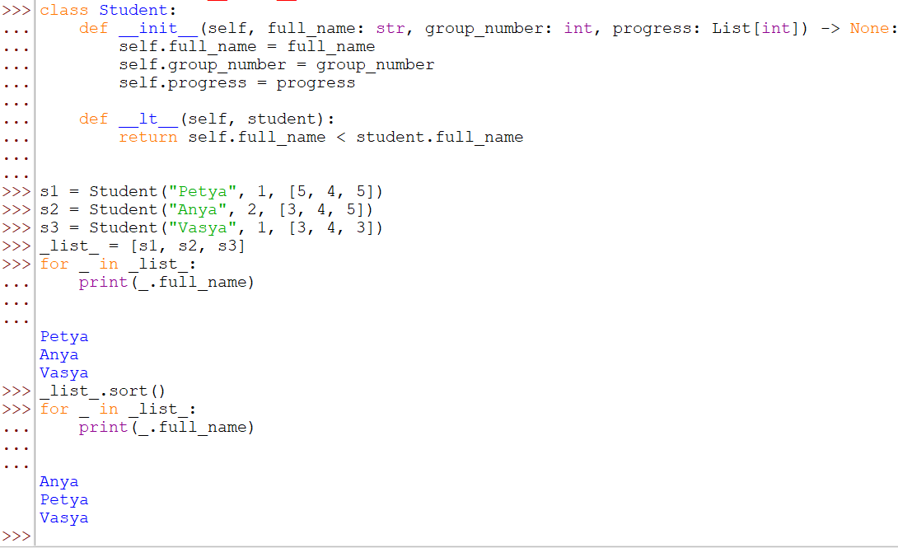
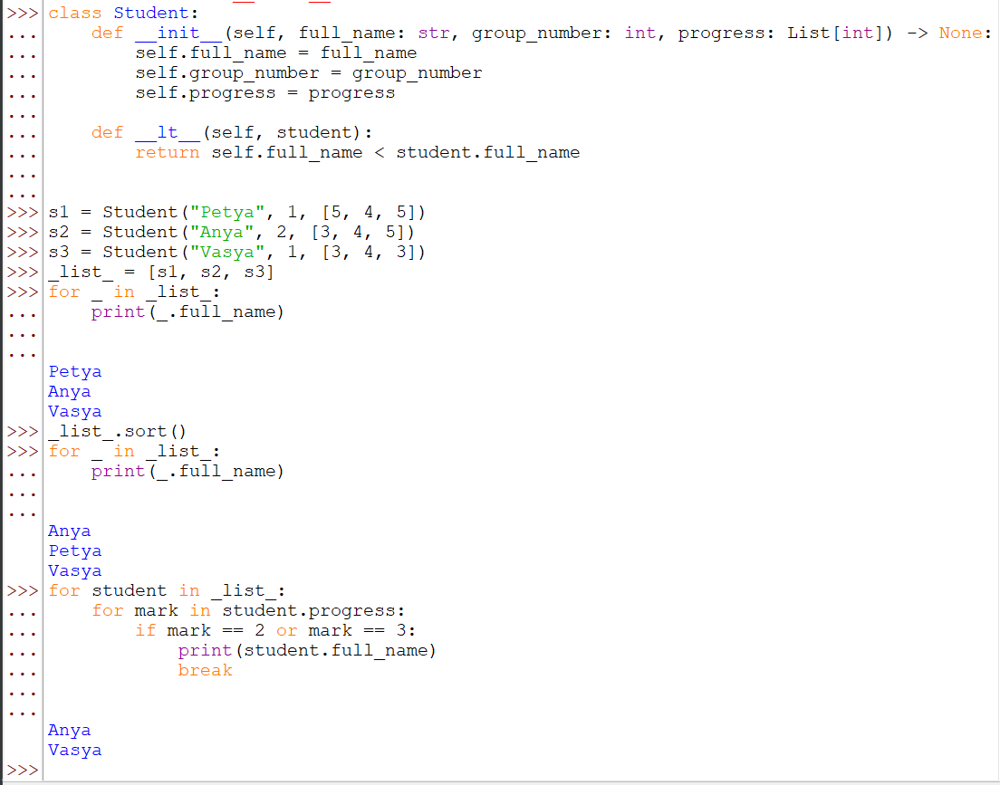

# Задачи

---
Используя объектно-ориентированный язык программирования Python, при помощи
классов можно решать различные задачи.

1. Создать класс “Student” который содержит следующие параметры (full_name - имя
студента, group_number - номер группы и progress - список полученных оценок);
2. Осуществить список, который сортируется по имени, затем выводятся студенты,
имеющие неудовлетворительные оценки.

# Решение

---
### 1) задача
Создадим класс `Student` с соответствующими полями
```python
from typing import List


class Student:
    def __init__(self, full_name: str, group_number: int, progress: List[int]) -> None:
        self.full_name = full_name
        self.group_number = group_number
        self.progress = progress
```
Мы создали класс `Student`, а также написали для него конструктор с полями `full_name` `group_number` `prоgress`. Также мы импортировали библиотеку `typing` для задания типа входных данных для поля `progress`   

### 2) задача
Создадим лист из 5 учеников для примера, а также допишем классу метод который позволит сортировать списки по имени студента
```python
# method
def __lt__(self, other):
    return self.age < other.age
```
Example:

> Далее несколько я понял, нужно после сортировки вывести студентов у которых есть отрицательные оценки


Реализация списка студентов, их сортировка, а также вывод: 
```python
# creating students
s1 = Student("Petya", 1, [5, 4, 5])
s2 = Student("Anya", 2, [3, 4, 5])
s3 = Student("Vasya", 1, [3, 4, 3])
# creating list
_list_ = [s1, s2, s3]
# testing user places
for _ in _list_:
    print(_.full_name)
# sort list
_list_.sort()
# confirming sort
for _ in _list_:
    print(_.full_name)

# iteration students and out students with bad marks
for student in _list_:
    for mark in student.progress:
        if mark == 2 or mark == 3:
            print(student.full_name)
            break
```

[Назад](../../readme.md)
